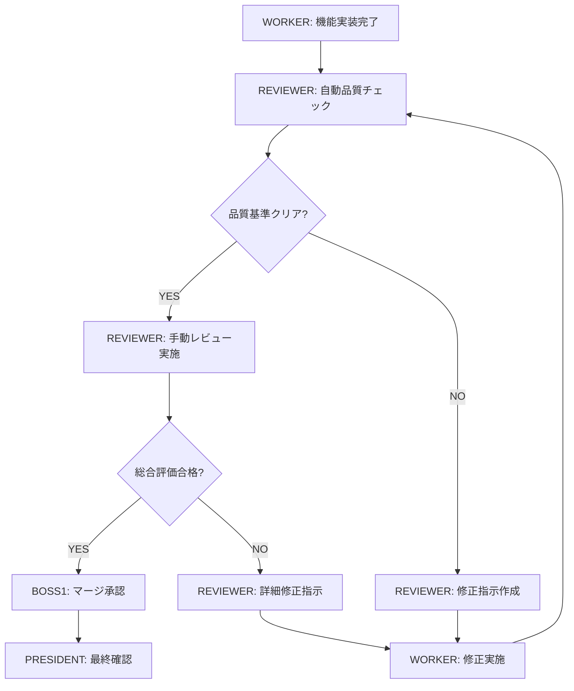
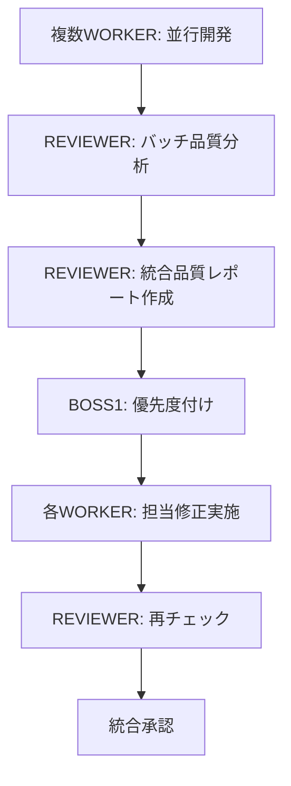

# 詳細設計書: REVIEWERエージェント

## 📋 目次
1. [システム概要](#システム概要)
2. [アーキテクチャ設計](#アーキテクチャ設計)
3. [レビュープロセス詳細](#レビュープロセス詳細)
4. [品質基準・KPI](#品質基準kpi)
5. [技術実装詳細](#技術実装詳細)
6. [運用・保守計画](#運用保守計画)
7. [リスク分析](#リスク分析)

## システム概要

### 🎯 目的
マルチエージェント開発環境において、コードの品質・保守性・セキュリティを統一的に管理し、技術的負債の蓄積を防止する。

### 🏗️ 基本方針
- **品質ファースト**: すべてのコードが品質基準を満たしてからマージ
- **自動化優先**: 人的ミスを排除し、効率的なレビューを実現
- **継続的改善**: レビュー結果を蓄積し、品質基準を継続的に向上

### 📊 現状課題の整理

#### 既存システムの問題点
1. **コードの重複**
   - 各WORKERが独立開発するため、似たような機能が重複実装される
   - 例: 認証ロジック、バリデーション処理、エラーハンドリング

2. **古いコード残存**
   - リファクタリング後も古い実装が残る
   - 使用されなくなったライブラリやモジュールの放置

3. **品質基準の不統一**
   - WORKER間でコーディングスタイルやアプローチが異なる
   - テストの質や網羅性にばらつき

4. **セキュリティ考慮漏れ**
   - 各WORKERのセキュリティ知識に依存
   - 統一的なセキュリティチェックが困難

## アーキテクチャ設計

### 🏛️ エージェント構成 (1:1:8:1)

```
┌─────────────┐  ┌─────────────┐  ┌─────────────┐
│👑 PRESIDENT │  │💼 BOSS1     │  │🔍 REVIEWER  │
│戦略・承認   │  │管理・調整   │  │品質・監査   │
└─────────────┘  └─────────────┘  └─────────────┘
                        ▲
                        │ 品質レポート
                        ▼
┌─────────────┬─────────────┬─────────────┬─────────────┐
│🎨 WORKER1   │⚙️ WORKER2   │🧪 WORKER3   │📚 WORKER4   │
│UI/UX        │Backend      │QA/Test      │Docs/DX      │
├─────────────┼─────────────┼─────────────┼─────────────┤
│⚡ WORKER5   │🔒 WORKER6   │🔍 WORKER7   │🚀 WORKER8   │
│Performance  │Security     │E2E Test     │DevOps       │
└─────────────┴─────────────┴─────────────┴─────────────┘
                        ▲
                        │ コード提出
                        ▼
                 🔍 REVIEWER による品質ゲート
```

### 🔄 レビューフロー設計

#### Pattern 1: 同期レビューフロー (推奨)


#### Pattern 2: 非同期レビューフロー (高頻度開発用)


### 🛡️ 品質ゲート設計

#### レベル1: 自動チェック (必須通過)
- **構文・スタイル**: ESLint、Prettier、言語固有のLinter
- **基本品質**: 複雑度、重複率、命名規約
- **セキュリティ基礎**: 基本的な脆弱性パターン
- **テスト必須**: 単体テスト存在確認

#### レベル2: 静的解析 (自動評価)
- **アーキテクチャ**: 依存関係、SOLID原則
- **パフォーマンス**: 計算量、メモリ使用量予測
- **保守性**: 技術的負債、コード臭い
- **ドキュメント**: コメント品質、README更新

#### レベル3: 手動レビュー (REVIEWER実施)
- **ロジック妥当性**: ビジネスロジックの正確性
- **設計適合性**: アーキテクチャ設計との整合性
- **ユーザビリティ**: UI/UX観点での評価
- **運用考慮**: ログ、監視、エラー処理

## レビュープロセス詳細

### 📝 REVIEWERの日次ワークフロー

#### 朝のセットアップ (9:00-9:30)
1. **前日の品質状況確認**
   - 未解決の品質課題リスト確認
   - 技術的負債の蓄積状況確認
   - KPI達成状況確認

2. **当日のレビュー計画策定**
   - BOSS1から当日の開発予定確認
   - レビュー優先度の設定
   - リソース配分計画

#### 継続監視・レビュー (9:30-17:30)
1. **リアルタイム品質監視**
   - 各WORKERのコミット監視
   - 自動品質チェックの結果監視
   - 品質低下の早期検出

2. **定期レビュー実施**
   - 2時間ごとの集中レビューセッション
   - 緊急度に応じた即時レビュー
   - クロスチェック（他WORKERコードとの整合性確認）

3. **課題対応・フィードバック**
   - 修正指示の詳細作成
   - WORKERへのコーチング・知識共有
   - BOSS1への品質状況報告

#### 夕方の総括 (17:30-18:00)
1. **日次品質レポート作成**
   - 当日発見した品質課題のまとめ
   - 修正完了状況の確認
   - 翌日への申し送り事項

2. **改善提案の整理**
   - 繰り返し発生する問題の分析
   - プロセス改善提案の作成
   - ツール・自動化の改善案

### 🎯 レビュー項目詳細

#### A. コード品質レビュー
1. **構造・設計**
   - [ ] 単一責任原則の遵守
   - [ ] 適切な抽象化レベル
   - [ ] インターフェース設計の妥当性
   - [ ] 依存関係の適切性

2. **実装品質**
   - [ ] アルゴリズムの効率性
   - [ ] エラーハンドリングの充実
   - [ ] ログ出力の適切性
   - [ ] リソース管理（メモリリーク対策）

3. **保守性**
   - [ ] コードの可読性
   - [ ] 適切なコメント
   - [ ] 命名の一貫性
   - [ ] マジックナンバーの排除

#### B. セキュリティレビュー
1. **入力検証**
   - [ ] すべての入力の検証
   - [ ] SQLインジェクション対策
   - [ ] XSS対策
   - [ ] CSRFトークン使用

2. **認証・認可**
   - [ ] 適切な認証機構
   - [ ] 権限チェックの実装
   - [ ] セッション管理の安全性
   - [ ] パスワード処理の安全性

3. **データ保護**
   - [ ] 機密データの暗号化
   - [ ] 通信の暗号化
   - [ ] ログでの機密データ排除
   - [ ] データベースアクセス制御

#### C. パフォーマンスレビュー
1. **計算効率**
   - [ ] 計算量の最適性（O記法評価）
   - [ ] 不要な処理の排除
   - [ ] キャッシュ活用
   - [ ] 遅延読み込み実装

2. **リソース使用**
   - [ ] メモリ使用量の最適化
   - [ ] ファイルハンドルの適切な管理
   - [ ] データベース接続の管理
   - [ ] ネットワーク通信の最適化

## 品質基準・KPI

### 📊 品質メトリクス定義

#### コード品質指標
| メトリクス | 目標値 | 測定方法 | 責任者 |
|-----------|--------|----------|--------|
| **重複コード率** | <5% | SonarQube | REVIEWER |
| **循環的複雑度** | 平均<10, 最大<20 | ESLint/SonarQube | REVIEWER |
| **テストカバレッジ** | >80% | Jest/Coverage | WORKER+REVIEWER |
| **技術的負債** | Aランク維持 | SonarQube | REVIEWER |
| **コードレビューカバー率** | 100% | Git/PR統計 | REVIEWER |

#### セキュリティ指標
| メトリクス | 目標値 | 測定方法 | 責任者 |
|-----------|--------|----------|--------|
| **脆弱性数** | 0件（高・中レベル） | Snyk/OWASP ZAP | REVIEWER |
| **セキュリティホットスポット** | 0件 | SonarQube | REVIEWER |
| **認証・認可テスト** | 100%カバー | 手動テスト | REVIEWER |

#### 効率性指標
| メトリクス | 目標値 | 測定方法 | 責任者 |
|-----------|--------|----------|--------|
| **レビュー時間** | 実装時間の20%以内 | 時間計測 | REVIEWER |
| **修正回数** | 平均2回以内 | Git履歴 | REVIEWER |
| **品質ゲート通過率** | 初回90%以上 | 自動計測 | REVIEWER |

### 🎯 KPI達成のための施策

#### 重複コード削減戦略
1. **事前検出**: コミット前フック
2. **定期スキャン**: 週次全体スキャン
3. **リファクタリング**: 月次重複解消セッション
4. **予防教育**: 設計パターン共有

#### テストカバレッジ向上戦略
1. **必須ルール**: 新規機能は80%以上必須
2. **可視化**: カバレッジレポートの共有
3. **インセンティブ**: 高カバレッジ達成者の表彰
4. **支援**: テスト作成のペアプロ実施

## 技術実装詳細

### 🛠️ ツール構成

#### 静的解析ツールチェーン
```yaml
# JavaScript/TypeScript
primary:
  - ESLint (構文・スタイル)
  - Prettier (フォーマット)
  - TypeScript Compiler (型チェック)

secondary:
  - SonarQube (品質・セキュリティ)
  - JSHint (補完的チェック)

# Python
primary:
  - Pylint (構文・スタイル)
  - Black (フォーマット)
  - mypy (型ヒント)

secondary:
  - SonarQube (品質・セキュリティ)
  - Bandit (セキュリティ)

# 共通
cross_language:
  - SonarQube (品質総合)
  - Snyk (セキュリティ脆弱性)
  - CodeClimate (技術的負債)
```

#### 自動化スクリプト設計
1. **pre-commit hooks**
   ```bash
   #!/bin/bash
   # .git/hooks/pre-commit

   # 基本品質チェック
   npm run lint
   npm run test:unit
   npm run security:scan

   # 重複チェック
   ./scripts/check-duplicates.sh

   # 品質ゲート
   if ! ./scripts/quality-gate.sh; then
     echo "❌ 品質基準を満たしていません"
     exit 1
   fi
   ```

2. **品質ダッシュボード**
   ```javascript
   // quality-dashboard.js
   class QualityDashboard {
     generateReport() {
       return {
         codeQuality: this.assessCodeQuality(),
         security: this.checkSecurity(),
         performance: this.analyzePerformance(),
         testCoverage: this.getTestCoverage(),
         technicalDebt: this.calculateTechnicalDebt()
       };
     }
   }
   ```

### 🔧 REVIEWERエージェントの技術スペック

#### 専用ツールセット
```bash
# REVIEWERの作業環境
reviewer_tools/
├── static-analysis/      # 静的解析ツール群
├── security-scanner/     # セキュリティチェッカー
├── performance-profiler/ # パフォーマンス分析
├── duplicate-detector/   # 重複コード検出
├── quality-reporter/     # 品質レポート生成
└── auto-fixer/          # 自動修正提案
```

#### 自動修正機能
```python
class AutoFixer:
    """自動修正提案エンジン"""

    def suggest_fixes(self, issues):
        fixes = []
        for issue in issues:
            if issue.type == "duplicate_code":
                fixes.append(self.extract_common_function(issue))
            elif issue.type == "security_vulnerability":
                fixes.append(self.apply_security_patch(issue))
            elif issue.type == "performance_issue":
                fixes.append(self.optimize_performance(issue))
        return fixes
```

## 運用・保守計画

### 📅 運用スケジュール

#### 日次タスク
- **09:00-09:30**: 前日課題確認・当日計画
- **09:30-12:00**: 午前のレビューセッション
- **13:00-15:00**: 午後のレビューセッション
- **15:00-17:00**: 集中修正支援・コーチング
- **17:00-18:00**: 日次レポート作成

#### 週次タスク
- **月曜**: 週次品質目標設定
- **水曜**: 中間品質評価・軌道修正
- **金曜**: 週次品質レポート・改善提案

#### 月次タスク
- **技術的負債の棚卸し**
- **品質基準の見直し**
- **ツール・プロセス改善**
- **WORKERへの教育・トレーニング**

### 🔄 継続的改善プロセス

#### PDCA サイクル
1. **Plan**: 品質目標・改善計画策定
2. **Do**: レビュー実施・課題対応
3. **Check**: 品質メトリクス評価
4. **Act**: プロセス・ツール改善

#### 学習機能
```python
class LearningEngine:
    """REVIEWERの学習エンジン"""

    def learn_from_reviews(self, review_history):
        """過去のレビュー結果から学習"""
        patterns = self.extract_common_issues(review_history)
        self.update_detection_rules(patterns)

    def predict_issue_likelihood(self, code_changes):
        """変更内容から問題発生確率を予測"""
        return self.ml_model.predict(code_changes)
```

## リスク分析

### ⚠️ 主要リスク

#### 技術的リスク
1. **レビューボトルネック**
   - リスク: REVIEWERが律速段階となる
   - 対策: 自動化率向上、段階的レビュー
   - 影響度: 高、確率: 中

2. **誤検出・見逃し**
   - リスク: 自動ツールの精度不足
   - 対策: 人的レビュー併用、ツール改善
   - 影響度: 中、確率: 低

#### 運用リスク
1. **REVIEWER不在時の品質低下**
   - リスク: 単一障害点
   - 対策: 副担当制、プロセス標準化
   - 影響度: 高、確率: 低

2. **WORKERのモチベーション低下**
   - リスク: 厳格なレビューへの反発
   - 対策: 教育的アプローチ、段階的導入
   - 影響度: 中、確率: 中

### 🛡️ リスク軽減策

#### 自動化によるリスク軽減
- 定型的チェックは100%自動化
- 人的レビューは本質的な部分に集中
- 段階的品質ゲートで早期発見

#### プロセスの冗長性
- 複数の品質チェック手段
- WORKERの自己チェック機能強化
- 相互レビューの導入

---

## 📋 次のステップ

この詳細設計書を基に、以下の検討を行ってください：

1. **優先度の確認**
   - どの機能から実装開始するか？
   - 段階的導入のタイムライン

2. **リソース配分**
   - REVIEWERエージェントの専任度
   - 自動化ツールの導入コスト

3. **品質基準のカスタマイズ**
   - プロジェクト固有の品質要件
   - KPIの妥当性

4. **運用方法の詳細化**
   - 具体的なワークフロー
   - エスカレーション手順

この設計書について、特に気になる点や変更したい部分があれば教えてください。